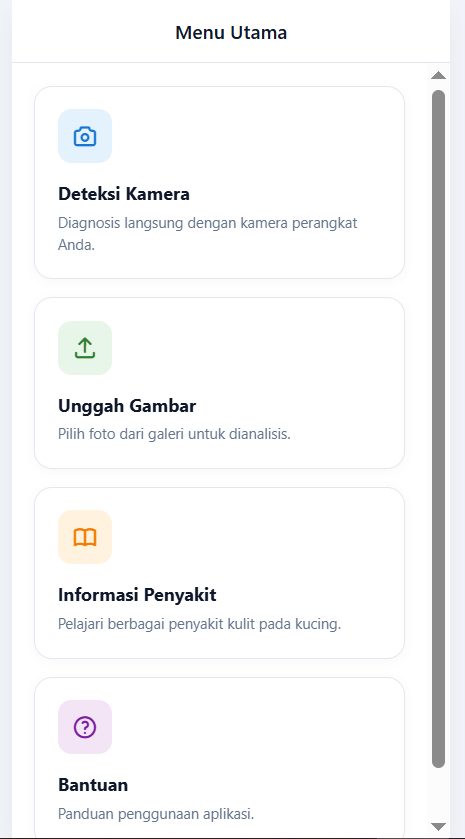
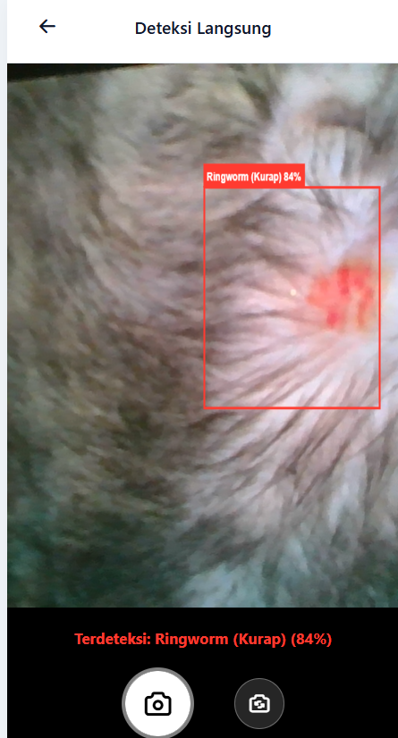
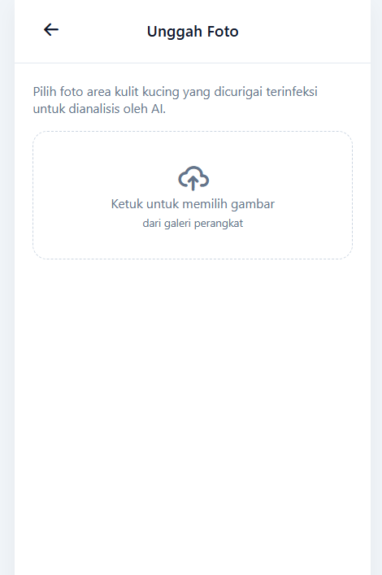
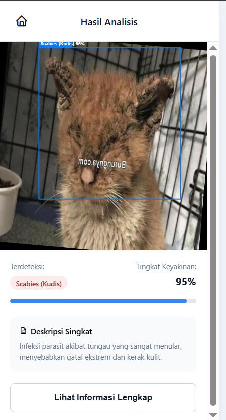
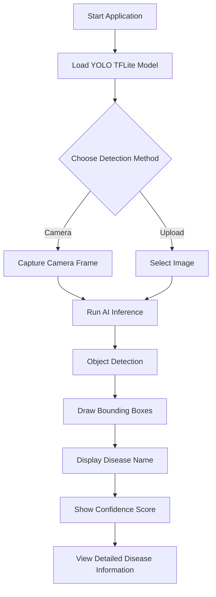

# 🐱 Cat Skin Disease Detector Web


A web-based Artificial Intelligence application for detecting cat skin diseases directly in the browser using a YOLO object detection model converted to TensorFlow Lite (TFLite). The application supports both real-time camera detection and image upload detection without requiring a backend server.

---

## 📖 Overview

Skin diseases are among the most common health problems affecting cats. Early detection is important to prevent disease progression and improve treatment outcomes.

This project implements a computer vision system capable of detecting skin diseases in cats through digital images using a YOLO-based object detection model deployed entirely in the browser with TensorFlow.js.

The application is designed to be lightweight, responsive, and accessible from both desktop and mobile devices.

---

## ✨ Features

- 📷 Real-time camera detection
- 🖼️ Detection from uploaded images
- 🎯 Bounding box visualization
- 📊 Confidence score display
- 📚 Disease information and treatment guidance
- 📱 Responsive mobile and desktop interface
- ⚡ Browser-based AI inference
- 🔒 No server-side image processing

---

## 🧠 Detected Diseases

The model is trained to recognize several cat skin conditions:

| Disease | Description |
|----------|------------|
| Flea Allergy Dermatitis | Allergic reaction caused by flea bites |
| Ringworm | Fungal skin infection |
| Mange | Skin disease caused by mites |
| Healthy | Normal skin condition |

> The complete disease database and descriptions are stored in `js/data.js`.

---

## 🏗️ System Architecture

```text
User
 │
 ▼
Camera / Upload Image
 │
 ▼
TensorFlow.js
 │
 ▼
TFLite YOLO Model
 │
 ▼
Object Detection
 │
 ▼
Bounding Box + Confidence Score
 │
 ▼
Disease Information Display
```

---

## 🛠️ Technologies Used

| Technology | Purpose |
|------------|----------|
| HTML5 | User Interface Structure |
| CSS3 | Styling and Responsive Design |
| JavaScript (ES6) | Application Logic |
| TensorFlow.js | Browser AI Inference |
| TensorFlow Lite | Optimized AI Model |
| YOLO | Object Detection |
| WebRTC | Camera Access |

---

## 📂 Project Structure

```text
cat-skin-detector-web/
│
├── index.html
│
├── css/
│   └── style.css
│
├── js/
│   ├── app.js
│   ├── data.js
│   ├── yolo.js
│   └── page-loader.js
│
├── pages/
│   ├── splash.html
│   ├── home.html
│   ├── camera.html
│   ├── upload.html
│   ├── processing.html
│   ├── result.html
│   ├── disease-list.html
│   ├── disease-detail.html
│   └── help.html
│
├── models/
│   └── best_float32.tflite
│
├── assets/
│   ├── home.png
│   ├── camera.png
│   ├── upload.png
│   └── result.png
│
└── README.md
```

---

## 🚀 Installation

### Clone Repository

```bash
git clone https://github.com/Telolet702/cat-skin-detector-web.git
```

```bash
cd cat-skin-detector-web
```

---

## ▶️ Run Locally

### Option 1: Python

```bash
python -m http.server 8000
```

Open:

```text
http://localhost:8000
```

### Option 2: VS Code Live Server

1. Install Live Server Extension
2. Open project folder
3. Right-click `index.html`
4. Select **Open with Live Server**

### Option 3: Node.js

```bash
npx serve
```

---

## 📱 Application Screenshots

### Home Page



### Real-Time Detection



### Image Upload



### Detection Result



---

## 🎯 Model Information

| Item | Value |
|--------|--------|
| Model Architecture | YOLO |
| Deployment Format | TensorFlow Lite |
| Inference Engine | TensorFlow.js |
| Input Resolution | 640 × 640 |
| Detection Type | Object Detection |
| Deployment Platform | Browser |

---

## 📊 Model Performance

The final model achieved the following evaluation results:

| Metric | Score |
|----------|----------|
| mAP@50 | 88.99% |
| Precision | High |
| Recall | High |

These results indicate that the model can accurately identify and localize cat skin diseases in images.

---

## 🔄 Application Workflow



---

## 🌐 Browser Compatibility

| Browser | Supported |
|----------|-----------|
| Google Chrome | ✅ |
| Microsoft Edge | ✅ |
| Firefox | ✅ |
| Android Chrome | ✅ |
| Safari iOS | ✅ |

---

## 🎓 Research Purpose

This project was developed as part of an Artificial Intelligence and Computer Vision research project focused on the implementation of object detection techniques for cat skin disease recognition using digital images.

The system demonstrates how deep learning models can be deployed efficiently in web environments without requiring cloud inference services.

---

## 👨‍💻 Author

**Ahmad Khumaeni Gibran**

Artificial Intelligence & Web-Based Computer Vision Research

GitHub: https://github.com/Telolet702

---

## 📄 License

This project is intended for educational, research, and academic purposes.

Feel free to use, modify, and improve the project with proper attribution.
